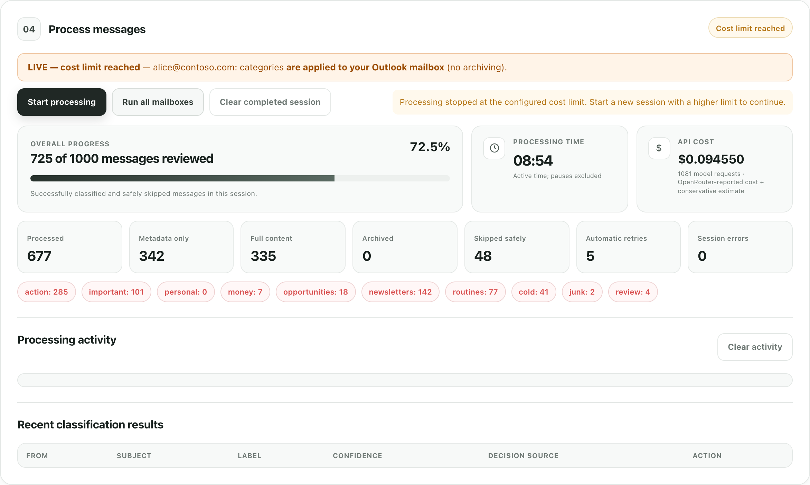
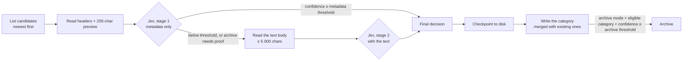
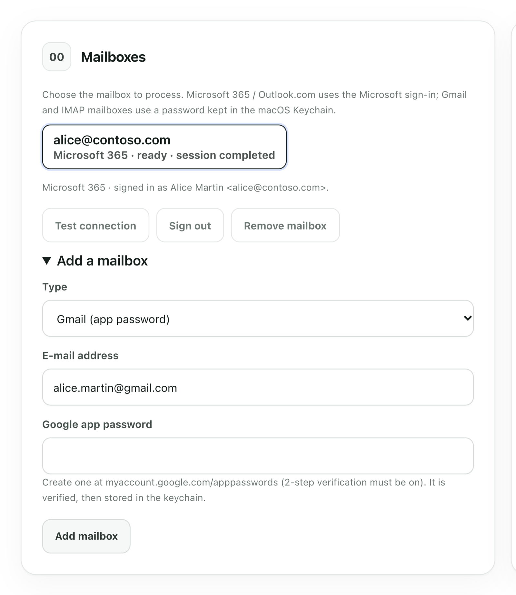
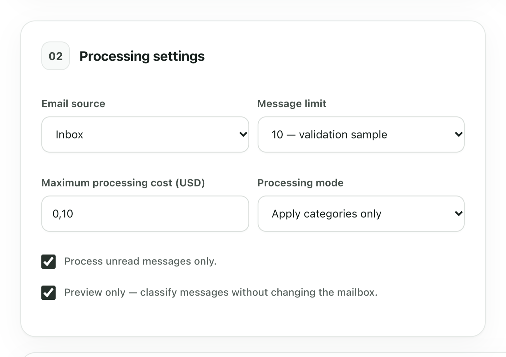

# jevOutlook

**Semantic classification of your Outlook, Gmail and IMAP mailboxes with Jev — one category per message, preview by default, a hard cost cap, everything running on your own machine.**

[](LICENSE)
[](https://dotnet.microsoft.com/)
[](tests/JevOutlook.Tests)
[](https://vincentlauriat.github.io/MailClassification.jev/)

jevOutlook reads the messages of one or several mailboxes, asks **Jev** (TypeSafe's
System One decision model, reached through OpenRouter) which of *your* categories each
message belongs to, and writes that one category back as an Outlook category, a Gmail
label or an IMAP keyword. It never deletes, never marks as junk, never sends. Archiving
is optional, separately gated, and off by default.

<p align="center">
  
</p>

> **Where it comes from.** jevOutlook started as the Microsoft-platform port of
> [jevMail](https://github.com/ilyamk/jev-gmail-ai-spam-filter-and-labeling) (Gmail +
> Google Apps Script, MIT) — same decision logic, same playbooks, same safety model —
> rewritten in **C# / .NET 10** for Microsoft Graph, then extended to Gmail and any IMAP
> server so one local app can triage every mailbox you own.

---

## Table of contents

1. [What it does, in one minute](#1-what-it-does-in-one-minute)
2. [Is it for you?](#2-is-it-for-you)
3. [How a message gets its category](#3-how-a-message-gets-its-category)
4. [Which mailboxes work, and what each one needs](#4-which-mailboxes-work-and-what-each-one-needs)
5. [Install](#5-install)
6. [Set up, step by step](#6-set-up-step-by-step)
   - [6.1 The model: an OpenRouter key](#61-the-model-an-openrouter-key)
   - [6.2 Microsoft 365 / Outlook.com mailboxes](#62-microsoft-365--outlookcom-mailboxes)
   - [6.3 Gmail mailboxes](#63-gmail-mailboxes)
   - [6.4 Any other IMAP mailbox](#64-any-other-imap-mailbox)
   - [6.5 Keep the dashboard running (macOS)](#65-keep-the-dashboard-running-macos)
   - [6.6 The Outlook add-in (Microsoft 365)](#66-the-outlook-add-in-microsoft-365)
7. [Your first run (preview)](#7-your-first-run-preview)
8. [Going live: categories, then archiving](#8-going-live-categories-then-archiving)
9. [Categories: playbooks and your own rules](#9-categories-playbooks-and-your-own-rules)
10. [Understanding confidence and the two thresholds](#10-understanding-confidence-and-the-two-thresholds)
11. [What it costs](#11-what-it-costs)
12. [Command reference](#12-command-reference)
13. [Files, state and secrets](#13-files-state-and-secrets)
14. [Troubleshooting](#14-troubleshooting)
15. [Privacy and data handling](#15-privacy-and-data-handling)
16. [Limitations](#16-limitations)
17. [Under the hood](#17-under-the-hood)
18. [Credits and license](#18-credits-and-license)

---

## 1. What it does, in one minute

Email filters match exact senders and keywords. Real inboxes are not sorted that way: a
message is *"something I must answer"*, *"a receipt"*, *"a newsletter"* or *"cold outreach"*
because of what it **means**, not because of a word it contains.

jevOutlook lets you describe up to twelve categories in plain language, for example:

> **action-required** — A legitimate message that requires a reply, decision, approval,
> task, or time-sensitive intervention. Excludes optional reading and routine confirmations.

Then, for each message, it asks Jev a single question — *"which of these categories fits
this email?"* — and receives a **choice plus a probability for every option**. That
probability is the confidence. If it is high enough, the category is written to the
message. If it is not, jevOutlook fetches the message text and asks again with more
context. Every decision is saved before anything is written, so an interrupted run
resumes without paying twice.

Three properties make it safe to point at a real mailbox:

| Property | What it means in practice |
| --- | --- |
| **Preview by default** | The first run classifies and shows you a table; nothing is written until you untick "Preview only" (dashboard) or pass `--live` (CLI). |
| **A cost cap per run** | Before every model request, the remaining budget is checked; the run stops on its own at the cap. A 100-message run costs about one cent. |
| **Fails closed** | An invalid model answer, an unreadable body, a vanished message, a throttled server: the message is skipped or the run pauses. The mailbox is never modified on doubt. |

## 2. Is it for you?

**Yes, if** you have one or several mailboxes that receive more mail than you can sort,
you are comfortable running a small program on your computer, and you want to keep
your data on that computer: jevOutlook has no server, no account, no telemetry.

**Probably not, if** you need a hosted service that classifies mail while your computer
is off, or if you want folders rather than categories: jevOutlook deliberately uses the
mailbox's native label mechanism (Outlook categories, Gmail labels, IMAP keywords)
because labels survive moves, work in every client and never fight with your existing
folder structure.

**Not at all, if** your organisation forbids sending email content to third-party AI
services. The headers, preview and (sometimes) the text body of each processed message
are sent to OpenRouter / TypeSafe. See [§15](#15-privacy-and-data-handling).

## 3. How a message gets its category



Step by step, for one batch of up to 50 messages:

1. **Listing.** The mailbox is scanned newest-first from a cursor (a timestamp on Graph,
   a UID on IMAP). Messages that already carry one of your categories are skipped: that
   is how jevOutlook knows a message was processed by an earlier run, without adding any
   technical marker. Junk, Deleted Items and Drafts are never candidates.
2. **Stage 1 — metadata.** For each candidate, jevOutlook sends Jev the sender, the
   recipients, the subject, the date, the mailing-list and automation headers
   (`List-Id`, `List-Unsubscribe`, `Auto-Submitted`, `Precedence`…), the importance and the
   first 255 characters of the body. That is cheap and usually enough: in a real run of
   100 messages, 79 were decided at this stage.
3. **The decision rule.** Jev answers with one category and a probability for each. If
   the confidence is at least the **metadata threshold** (0.75 by default), the decision is
   final. Otherwise — or when the category is archive-eligible in archive mode and the
   confidence is below the stricter **archive threshold** (0.93) — the message goes to stage 2.
4. **Stage 2 — full text.** The text body is fetched (HTML converted to text, capped at
   5 000 characters, keeping the head and the tail of very long messages) and Jev is asked
   again. If the body is empty or unreadable, the message falls back to the safe `review`
   category when your rules have one, and is otherwise skipped.
5. **Checkpoint.** Every paid decision is written to the session file *before* the mailbox
   is touched. Stop the run at any moment (Ctrl+C, closing the browser tab): resuming
   never re-asks the model for a message that already has an answer.
6. **Write.** Categories are written in grouped, idempotent operations: the current
   categories of each message are re-read at that moment, your category is **added** to
   them (nothing is removed), then archive moves come last. A message that vanished in the
   meantime counts as done.

Every message ends up in the results table with its sender, subject, category,
confidence, decision stage (`metadata`, `full` or `metadata_fallback`) and action
(`would categorize`, `categorized`, `archived`, `skipped-…`).

## 4. Which mailboxes work, and what each one needs

| Mailbox | How jevOutlook connects | What you need once | "Category" means | "Archive" means |
| --- | --- | --- | --- | --- |
| **Microsoft 365** (work / school) and **Outlook.com** | Microsoft Graph, delegated permissions, device-code sign-in | An Entra ID app registration (10 minutes, [§6.2](#62-microsoft-365--outlookcom-mailboxes)), shared by all your Microsoft mailboxes, then one sign-in per mailbox | An Outlook **category** (created in the master list with a colour) | Move to the **Archive** folder |
| **Gmail** | IMAP (`imap.gmail.com:993`) with a Google **app password** | 2-step verification on the Google account, then an app password ([§6.3](#63-gmail-mailboxes)); no Google Cloud project | A Gmail **label** | Remove from the Inbox (the message stays in All Mail, like Gmail's own Archive) |
| **Any IMAP server** (Dovecot, Cyrus, Courier, most hosted mail) | IMAP over TLS with the mailbox password | The IMAP host and the password ([§6.4](#64-any-other-imap-mailbox)) | An IMAP **keyword** (a custom flag) — the server must allow them, most do | Move to an `Archive` folder (created if missing) |

Two things cannot be designed away:

- **Microsoft 365 needs the Microsoft sign-in.** Exchange Online stopped accepting
  password-based IMAP in 2022. There is no way to reach a Microsoft 365 mailbox from a
  program without an Entra app registration and a delegated sign-in. jevOutlook keeps that
  to the minimum: one registration for all your Microsoft mailboxes, a code to type once
  per mailbox, silent renewal afterwards.
- **Generic IMAP mailboxes are scanned Inbox-only**, because IMAP has no "whole mailbox"
  view. Outlook and Gmail support the whole-mailbox scope.

## 5. Install

Requirements: the [.NET 10 SDK](https://dotnet.microsoft.com/download) (macOS, Windows or
Linux) and Git. Passwords are stored in the macOS Keychain; on other systems they go to a
file readable only by you (see [§13](#13-files-state-and-secrets)).

```bash
git clone https://github.com/vincentlauriat/MailClassification.jev.git
cd MailClassification.jev
dotnet build -c Release
```

The executable is `src/JevOutlook/bin/Release/net10.0/jevoutlook`. Put that directory on
your `PATH`, or produce a single self-contained binary:

```bash
dotnet publish src/JevOutlook -c Release -o release/jevoutlook
```

Check that it runs and read the built-in help:

```bash
jevoutlook version
jevoutlook help
```

## 6. Set up, step by step

You can do everything from the **dashboard** (a local web page, recommended for the first
time) or from the **terminal**. Both talk to the same state directory, so you can mix them.

```bash
jevoutlook ui        # starts http://127.0.0.1:5177/ and opens your browser
```

The page listens on your computer only. It is the same workflow as jevMail's web app:
mailboxes at the top, then the model key, the processing settings, the categories, and the
run itself with its live progress and results table.

### 6.1 The model: an OpenRouter key

Jev is reached through OpenRouter, which bills per request and reports the exact cost.

1. Create an account at <https://openrouter.ai/> and add a small credit (a few dollars go
   a long way: about one cent per hundred messages).
2. Create a **dedicated key** at <https://openrouter.ai/workspaces/default/keys>, ideally
   with a credit limit.
3. Give it to jevOutlook, either for the current shell only or stored on disk:

```bash
export OPENROUTER_API_KEY=sk-or-...      # preferred: nothing written to disk
# or
jevoutlook key set sk-or-...             # stored in ~/.jevoutlook/config.json (mode 0600)
jevoutlook key test                      # one tiny request against a sample email → "OK — model ~typesafe/jev-latest"
```

In the dashboard: card **01 Connect OpenRouter**, paste the key, **Verify connection**.

If you have a direct TypeSafe API key instead: `jevoutlook config set provider typesafe`
and use `JEV_API_KEY`. Both providers return the same answer format.

### 6.2 Microsoft 365 / Outlook.com mailboxes

This is the Microsoft equivalent of "enable the Gmail API": you register jevOutlook as an
application that is allowed to act on **your** mailbox, under **your** identity. Skip this
section entirely if you only have Gmail / IMAP mailboxes.

**Register the application (once, for all your Microsoft mailboxes)**

1. Open <https://entra.microsoft.com> → **Applications → App registrations → New registration**.
2. Name: `jevOutlook` (any name works). Supported account types: **Accounts in any
   organizational directory and personal Microsoft accounts** — this lets one registration
   serve a work mailbox and an Outlook.com mailbox. Choose *this organization only* if
   your tenant requires it.
3. Redirect URI: platform **Mobile and desktop applications**, URI `http://localhost`.
4. After creation: **Authentication → Advanced settings → Allow public client flows: Yes**
   (needed for the device-code sign-in).
5. **API permissions → Add a permission → Microsoft Graph → Delegated**:
   `Mail.ReadWrite`, `MailboxSettings.ReadWrite`, `User.Read`.
6. Copy the **Application (client) ID** and give it to jevOutlook:

```bash
jevoutlook config set client-id <application-client-id>
```

**Add the mailbox**

```bash
jevoutlook account add alice@contoso.com --m365
```

A line appears: *"To sign in, use a web browser to open https://microsoft.com/devicelogin
and enter the code ABCD1234"*. Do that, sign in with the mailbox's account, accept the
permissions. jevOutlook then prints `Signed in as Alice Martin <alice@contoso.com>`.

In the dashboard: **Add a mailbox → Microsoft 365 / Outlook.com**, type the address,
**Add mailbox**; the code and the link appear under the mailbox chip.

For a personal Outlook.com account, set the tenant to `consumers` (dashboard field
"Tenant", or `--tenant consumers`).

**"Admin approval required".** If the sign-in page says *"Approbation administrateur
requise"* / *"Need admin approval"*, the organisation that owns the mailbox restricts which
applications users may consent to (the default policy blocks unverified publishers asking
for more than low-impact permissions). This is a tenant policy, not something jevOutlook
can bypass. Three real options:

- You are a Global Administrator of that tenant: open
  `https://login.microsoftonline.com/<tenant-id>/adminconsent?client_id=<application-client-id>&redirect_uri=http://localhost`
  once, signed in as the admin. Consent is then granted for the whole tenant.
- Ask the tenant's administrator to approve the application (the blocked page has a
  "Request approval" button).
- Register the application **inside that tenant** (same steps, account type *this
  organization only*) and use its client id for that mailbox.

The sign-in is cached by MSAL (Keychain on macOS, DPAPI on Windows) and a small
authentication record is saved per mailbox, so later runs are silent. When it expires:
`jevoutlook account login <id>`.

### 6.3 Gmail mailboxes

jevOutlook talks to Gmail over IMAP with a **Google app password** — a 16-character
password that Google issues for a single application. No Google Cloud project, no OAuth
consent screen.

1. On the Google account, turn on **2-Step Verification** (Google → Security). App
   passwords only exist for accounts that have it.
2. Open <https://myaccount.google.com/apppasswords>, name the app `jevOutlook`, and copy
   the 16 characters Google shows once.
3. Add the mailbox; the password is asked with the echo off, verified against Gmail, and
   only then stored in the Keychain:

```bash
jevoutlook account add alice.martin@gmail.com --gmail
Gmail app password: ****************
Connecting to imap.gmail.com:993…
Connected as alice.martin@gmail.com (Gmail; labels; archive available).
```

In the dashboard: **Add a mailbox → Gmail (app password)**.

Your categories become Gmail labels (created if missing, visible in every Gmail client).
Archiving removes the message from the Inbox exactly like Gmail's own Archive button.

<p align="center">
  
</p>

### 6.4 Any other IMAP mailbox

```bash
jevoutlook account add alice@example.org --imap mail.example.org:993
Mailbox password: ********
```

Add `--username <login>` when the IMAP login differs from the address. Port 993 uses TLS
from the start; any other port tries STARTTLS.

Your categories become IMAP **keywords** (custom flags on the message, shown by clients
such as Thunderbird, Apple Mail and Roundcube). The server has to allow custom keywords:
Dovecot, Cyrus and Courier do; if yours does not, jevOutlook says so at the first live run
and writes nothing. Archiving moves the message to an `Archive` folder (the server's
special-use folder when it declares one, otherwise created).

**Check any mailbox**

```bash
jevoutlook account list
jevoutlook account test alice@example.org
Identity      : alice@example.org
Provider      : IMAP (keywords; archive available; whole-mailbox scope not supported)
Archive       : Archive moves the message to the Archive folder.
Inbox         : 1 240 messages, 87 unread
```

### 6.5 Keep the dashboard running (macOS)

`jevoutlook ui` stops when you close its terminal. To have the dashboard (and the Outlook
add-in pane, which the same process serves) available from login onward, install it as a
macOS **LaunchAgent**. Publish a stable copy first, so a later `dotnet build` or
`dotnet clean` does not pull the executable from under the agent:

```bash
dotnet publish src/JevOutlook -c Release -o ~/.jevoutlook/bin
~/.jevoutlook/bin/jevoutlook service install --exe ~/.jevoutlook/bin/jevoutlook
```

The agent runs `jevoutlook ui --no-open` at login, restarts it if it stops (at most every
30 seconds) and writes its output to `~/.jevoutlook/logs/ui.log`.

```bash
jevoutlook service status      # plist, agent loaded or not, /health probe, log path
jevoutlook service restart     # after publishing a new build
jevoutlook service uninstall   # stop the agent and remove it
```

- The API key is **not** copied into the agent: the property list is plain text. Store the
  key once with `jevoutlook key set <api-key>`; only `DOTNET_ROOT` and `JEVOUTLOOK_HOME`
  are carried over from your shell.
- Running `jevoutlook ui` by hand while the agent runs is harmless: it sees the running
  server through `GET /health`, prints *already running* and opens the browser.
- Custom ports: `service install --port 5177 --https-port 5178`.

### 6.6 The Outlook add-in (Microsoft 365)

A task pane inside Outlook classifies the message you are reading and applies the category
(or category + archive) in one click. The pane is served by the local server over HTTPS, so
it needs the ASP.NET development certificate and a running server
([§6.5](#65-keep-the-dashboard-running-macos) keeps it up):

```bash
dotnet dev-certs https --trust          # once
jevoutlook addin manifest               # writes release/jevoutlook-manifest.xml
```

In Outlook: **Get Add-ins → My add-ins → Add a custom add-in → Add from file**, then pick the
manifest. The pane uses the first signed-in Microsoft 365 mailbox and the stored API key.
Some organisations disable custom add-ins; the sideload then fails with a generic
"installation failed" and only the tenant administrator can change that.

## 7. Your first run (preview)

Keep the defaults for the first run: the **Inbox**, **unread messages only**, **10
messages**, **preview**, a **$0.10** budget.

<p align="center">
  
</p>

```bash
jevoutlook run                          # single mailbox
jevoutlook run --account alice@example.org
jevoutlook run --all-accounts           # every configured mailbox, one after another
```

Read the results table. Each row is one message:

| Column | What to look at |
| --- | --- |
| **Label** | The category Jev chose among yours. |
| **Confidence** | The probability of that category (0 to 1). Below 0.75 the text body was fetched. |
| **Decision source** | `metadata` (headers + preview were enough), `full` (the text was needed), `metadata_fallback` (no readable text, safe `review` applied). |
| **Action** | In preview: `would categorize` / `would archive`. Live: `categorized` / `archived`. Or `skipped-…` with the reason. |

If a message lands in the wrong category, the fix is almost always in the **criteria**: make
the description of the intended category more specific, or add an exclusion to the one that
captured it (*"Excludes …"*). Run the preview again on the same 10 messages
(`jevoutlook clear-job` then `run`: messages are not marked in preview, so they are
re-evaluated) until the table looks right.

## 8. Going live: categories, then archiving

**Categories only.** Untick "Preview only" in the dashboard, or:

```bash
jevoutlook run --live --limit 25
```

Your category is added to each message; existing categories are kept. Open the mailbox:
Outlook shows the coloured category, Gmail the label, an IMAP client the keyword. Search
now works by meaning: `category:action-required` in Outlook,
`label:action-required` in Gmail.

**With archiving.** Only after several validated runs. Archiving needs four things at once:
the archive mode, a category marked *archive eligible* in your rules (`spam: true`), a
confidence at least equal to the archive threshold, and — in the terminal — an explicit
confirmation:

```bash
jevoutlook run --live --mode labels-archive --archive-threshold 0.95 --limit 100
LIVE run with archiving on alice@contoso.com: messages classified as [routine-notifications, cold-outreach, junk] with confidence ≥ 0.95 will be archived.
Type 'yes' to continue:
```

Archived messages are not deleted: they are in the Archive folder (Outlook, IMAP) or in
All Mail (Gmail), still carrying their category.

**Pause, resume, forget.** `Ctrl+C` pauses safely at any time. `jevoutlook status` shows the
sessions (one per mailbox); `jevoutlook continue [--account <id>]` resumes one, and
`continue --max-spend 0.50` raises a budget that was reached; `jevoutlook clear-job` forgets
a finished session. A message that already carries one of your categories is skipped by
later runs: to reprocess it, remove the category and run again.

## 9. Categories: playbooks and your own rules

A rule is four fields:

```json
{ "id": "action-required", "name": "action-required", "description": "A legitimate message that requires a reply, decision, approval, task, or time-sensitive intervention. Includes unresolved access, security, payment, delivery, legal, or account problems. Excludes optional reading and routine confirmations.", "spam": false }
```

- `name` is what gets written to the message (Outlook category, Gmail label, IMAP keyword).
  It cannot contain `,` or `;`. For IMAP keywords keep it to letters, digits, `-` and `_`
  (the playbook names already are).
- `description` is the **criterion sent to Jev verbatim**. Write it like the examples:
  what belongs, then what is explicitly excluded.
- `spam: true` marks the category **archive eligible**. Nothing else changes for it.
- At most 12 rules. A `review` rule ("does not clearly fit any other category") is
  strongly recommended: it is the safe fallback when the text cannot be read.

Rules are shared by all your mailboxes and edited in the dashboard (card **03**) or as JSON:

```bash
jevoutlook playbooks                    # the 7 ready-made sets
jevoutlook rules use universal          # load one (this is the default)
jevoutlook rules export my-rules.json   # edit…
jevoutlook rules import my-rules.json   # …and load back (validated)
jevoutlook rules show
```

The default **Universal inbox** playbook:

| Category | Criterion (summary) | Archive eligible |
| --- | --- | :---: |
| `action-required` | Needs a reply, decision, approval, task or time-sensitive intervention. | No |
| `important-update` | Meaningful update worth keeping, no action needed now. | No |
| `personal` | Person-to-person conversation. | No |
| `money-and-orders` | Receipts, invoices, orders, bank notices without an open problem. | No |
| `opportunities` | Specific, credible job / business / partnership opportunity. | No |
| `newsletters` | Opt-in recurring editorial content. | No |
| `routine-notifications` | Low-risk automated notifications. | **Yes** |
| `cold-outreach` | Unsolicited commercial, recruiting or PR outreach. | **Yes** |
| `junk` | Phishing, scams, irrelevant mass spam. | **Yes** |
| `review` | Safe fallback for ambiguous legitimate mail. | No |

The six other playbooks target a role, with categories such as:

| Playbook | Categories |
| --- | --- |
| `founders-operators` | decision-required · customer-risk · investor-and-board · team-blocker · delegatable · vendor-pitch* · review |
| `sales-business-development` | hot-lead · deal-action · partner-opportunity · customer-success · sales-automation · irrelevant-outreach* · review |
| `investors` | founder-intro · active-deal · portfolio-action · lp-and-fund · ecosystem-update · mass-fundraising-pitch* · review |
| `recruiting-people` | candidate-action · interview-scheduling · offer-and-closing · employee-sensitive · ats-automation · recruiting-vendor-pitch* · review |
| `freelancers-creators` | qualified-opportunity · client-action · payment-and-contract · audience-and-community · platform-update · low-quality-collab* · review |
| `support-commerce` | urgent-escalation · refund-or-billing · delivery-or-order · product-help · feedback-and-feature · automated-system-mail · review |

\* archive eligible. The playbooks are identical to jevMail's.

## 10. Understanding confidence and the two thresholds

Jev's answer to a Choice question is a probability distribution over your categories; the
chosen category's probability is the **confidence**. Two thresholds use it:

| Threshold | Default | Question it answers |
| --- | --- | --- |
| **Metadata confidence** | 0.75 | "Are the headers and the preview enough, or should I read the text?" Lower it and more messages are decided cheaply; raise it and more messages get the second, more informed look. |
| **Archive confidence** | 0.93 | "Am I sure enough to take a message out of the Inbox?" Only archive-eligible categories are concerned. It must be at least the metadata threshold. |

In a real run of 100 unread messages with the defaults, 79 were decided on metadata alone
and 20 needed the text (the last one had no readable text and was skipped). Confidences
of 0.90 and above are typical for newsletters and notifications; person-to-person mail
and edge cases sit lower, which is exactly where the second stage helps.

## 11. What it costs

Before each request, jevOutlook reserves a **conservative estimate** (payload size ×
1.25 tokens per character × $0.042 per million input tokens) against the run budget, then
replaces it with the **actual cost reported by OpenRouter** once the answer arrives. The
dashboard shows which source the total comes from.

Measured, with the defaults, on a Microsoft 365 Inbox:

| Run | Model requests | Cost |
| --- | --- | --- |
| 10 messages, preview | 15 | $0.0015 |
| 100 messages, live (categories) | 120 | $0.009 |

Model requests are sent concurrently (25 at a time, adapting to the provider) so a
hundred messages take about a minute. Mailbox reads and writes are the slow part on
Microsoft 365, which throttles at 4 concurrent requests per mailbox; jevOutlook stays
under that limit and honours the server's `Retry-After` when it does not.

## 12. Command reference

```
MAILBOXES
  account add <email> --m365 [--tenant <id>] [--device-code]   Microsoft 365 / Outlook.com (signs in right away)
  account add <email> --gmail                                  Gmail over IMAP (asks for a Google app password)
  account add <email> --imap <host[:port]> [--username <login>] Any IMAP server (asks for the mailbox password)
  account list                       Configured mailboxes and their state
  account test <id>                  Connect, show identity, folders and label support
  account login <id> [--device-code] Sign in again (Microsoft 365)
  account password <id>              Replace the stored password (IMAP / Gmail)
  account remove <id>                Forget a mailbox (and its password / sign-in)
  Most commands take --account <id|email>; it is optional with a single mailbox.

SETUP
  config set client-id <guid>        Entra ID app registration (client) id (Microsoft 365 only)
  config set tenant-id <id>          common (default) | organizations | consumers | <tenant guid>
  config set provider <name>         openrouter (default) | typesafe
  config set device-code true|false  Use the device-code flow instead of a browser
  config show
  key set <api-key> | key test [<api-key>] | key clear

CATEGORIES
  playbooks | rules show | rules use <playbook-id> | rules import <file.json>
  rules export <file.json> | rules reset | rules path

DASHBOARD
  ui [--port 5177] [--https-port 5178] [--no-https] [--no-open]
                                     Local web dashboard (reuses a server that is already running)
  addin manifest [--out file.xml]    Outlook add-in manifest (Microsoft 365 only)

SERVICE (macOS)
  service install [--port 5177] [--https-port 5178] [--exe <path>]
                                     Keep 'ui --no-open' running from login (LaunchAgent)
  service status [--port 5177]       Agent state, /health probe and log path
  service restart                    Restart the agent (after a rebuild)
  service uninstall                  Stop the agent and remove it

PROCESSING
  run [--account <id> | --all-accounts]     Start a session (PREVIEW by default)
    --scope inbox|all                Inbox (default) or the whole mailbox (Outlook, Gmail)
    --include-read                   Also process read messages (default: unread only)
    --limit N|all                    Number of messages (default 10)
    --mode labels|labels-archive     Categories only (default) or archive eligible categories
    --live                           Apply changes to the mailbox (default: preview only)
    --max-spend <usd>                Run budget per mailbox (default 0.10)
    --metadata-threshold <0.5-0.99>  Confidence required to trust the metadata pass (default 0.75)
    --archive-threshold <0.5-0.999>  Confidence required to archive (default 0.93)
    --yes                            Skip the confirmation for live archive runs
  continue [--max-spend <usd>] [--account <id>]   Resume a paused session
  status [--account <id>]            Show the current session(s)
  clear-job [--account <id>]         Forget a finished session

MAINTENANCE
  cleanup remove-category <name> [--account <id>] [--dry-run] [--keep-master]
                                     Remove a category from every message carrying it, then delete it

ENVIRONMENT
  OPENROUTER_API_KEY / JEV_API_KEY   API key (takes precedence over the stored key)
  JEVOUTLOOK_HOME                    State directory (default ~/.jevoutlook)
  JEVOUTLOOK_DEBUG=1                 Print stack traces and Microsoft Graph throttling details
```

Exit codes of `run` / `continue`: `0` completed, `1` error, `3` paused or budget reached.

## 13. Files, state and secrets

```
~/.jevoutlook/
  config.json            client id, tenant, provider, model, optional API key, device-code flag
  rules.json             your categories (shared by every mailbox)
  accounts.json          the mailboxes: id, address, kind, host, port — never a secret
  secrets.json           IMAP passwords — non-macOS only (macOS: Keychain, service "jevoutlook")
  accounts/<id>/
    auth-record.json     Microsoft sign-in record (no token inside; tokens live in the OS cache)
    job.json             the current session: options, cursor, counters, spend, checkpointed decisions
    job-rules.json       the rules frozen for that session
  logs/ui.log            output of the LaunchAgent (jevoutlook service install)
  bin/                   suggested location of the published executable used by the agent

~/Library/LaunchAgents/com.vincentlauriat.jevoutlook.plist   the LaunchAgent (macOS, no secret inside)
```

- A mailbox id is derived from its address: `alice@contoso.com` → `alice-contoso.com`.
- Every file is written atomically with mode 0600; the directory is 0700.
- On macOS, passwords go to the login Keychain through the system `security` tool. The
  first read may prompt macOS to allow `jevoutlook` to use the item; answer *Always allow*.
- Set `JEVOUTLOOK_HOME` to keep a separate state (for example one per profile).

## 14. Troubleshooting

| Symptom | Cause and fix |
| --- | --- |
| **"Need admin approval" / "Approbation administrateur requise"** at Microsoft sign-in | The tenant's consent policy. See the three options in [§6.2](#62-microsoft-365--outlookcom-mailboxes); none bypasses the policy. |
| **"No Entra ID application (client) id is configured"** | `jevoutlook config set client-id <guid>` (Microsoft mailboxes only). |
| **"Several mailboxes are configured; choose one with --account"** | Pass `--account <id or address>`, or `--all-accounts` on `run`. The dashboard always names the selected mailbox. |
| **Run pauses with "temporarily rate-limiting or unavailable"** | Microsoft Graph or the IMAP server throttled or dropped the connection after the retries. Every decision is saved: wait a minute and `jevoutlook continue`. With `JEVOUTLOOK_DEBUG=1` the exact HTTP status and `Retry-After` are printed. |
| **Gmail refuses the password** | It must be a 16-character **app password**, not the account password, and 2-step verification must be on. Store a new one: `jevoutlook account password <id>`. |
| **"This IMAP server does not accept custom keywords"** | The server does not advertise `PERMANENTFLAGS \*`. jevOutlook cannot label messages there; it writes nothing. |
| **"The mailbox was rebuilt (UIDVALIDITY changed)"** | The IMAP server renumbered the folder; the session cursor is meaningless. `jevoutlook clear-job --account <id>` and start again. |
| **"Microsoft sign-in is required or has expired"** | `jevoutlook account login <id>`. |
| **Same messages keep coming back in preview** | Expected: preview writes nothing, so nothing marks them as processed. In live mode they carry your category and are skipped. |
| **"Scanned 40 pages of already-processed messages"** | Everything recent already carries a category. `continue` scans older mail; or start a new session with `--include-read` / a different scope. |
| **Outlook add-in pane shows "Local server unreachable"** | The local server stopped. `jevoutlook service status`, then `jevoutlook service restart` (or `service install` once, see [§6.5](#65-keep-the-dashboard-running-macos)). |
| **"Port 5177 answers but not as a current jevOutlook"** | Another program, or an older jevOutlook build without `/health`, holds the port. Stop it (`pkill -f "jevoutlook ui"`) or pass `--port`. |
| **Dashboard says "Cross-site or non-JSON requests … are rejected"** | The local API only answers same-origin JSON requests from its own page, on purpose (protection against DNS rebinding). Open <http://127.0.0.1:5177/> directly. |

## 15. Privacy and data handling

- The app runs on your machine. Microsoft mailboxes are reached with delegated permissions
  granted to **your own** Entra app registration; Gmail and IMAP mailboxes with a password
  that stays in the Keychain. There is no jevOutlook server, account or telemetry.
- For each selected message, the model provider receives: your category names and
  criteria, the sender, recipients, subject and date, the mailing-list and automation
  headers, the importance, the 255-character preview, and — only when the confidence
  policy requires it — up to 5 000 characters of text body. Attachments are never sent.
  Requests are independent: one message is never combined with another.
- Email content is passed to the model as untrusted data; the prompt tells the model never
  to follow instructions found in an email.
- Review [OpenRouter's privacy policy](https://openrouter.ai/docs/features/privacy-and-logging)
  and [TypeSafe's data handling](https://docs.typesafe.ai/models#data-handling) before
  processing sensitive mail. This project is not a substitute for your organisation's
  compliance review.

## 16. Limitations

- AI classification can be wrong; confidence reduces the risk but does not remove it.
  Validate on your own mail before enabling live writes, and again before archiving.
- Exactly one category per message per run; only text is evaluated (no attachments, no images).
- Jev accepts multilingual text but English is its strongest language.
- Messages arriving after a session starts are not part of that session.
- Microsoft Graph throttling (about 4 concurrent requests per mailbox, 10 000 requests per
  10 minutes), IMAP connection limits and provider quotas still apply: the run pauses safely
  and can be continued.
- Generic IMAP mailboxes are Inbox-only and need a server that accepts custom keywords.
- Verified live on a Microsoft 365 mailbox; the Gmail and IMAP providers are covered by
  unit tests and follow the IMAP standard and Gmail's documented extensions, but had not
  been run against a real account at the time of writing.
- Provided as-is, under the MIT license.

## 17. Under the hood

| Concern | Choice |
| --- | --- |
| Language / runtime | C# 13, .NET 10; one executable that is both the CLI and the local dashboard (ASP.NET Core minimal API on 127.0.0.1) |
| Microsoft mailboxes | Microsoft Graph v1.0 REST over `HttpClient` (no SDK): `$batch` reads, category `PATCH`, archive `move`; sign-in with `Azure.Identity` |
| Gmail / IMAP mailboxes | [MailKit](https://github.com/jstedfast/MailKit): UID cursor, `X-GM-LABELS` for Gmail, keywords (`STORE ±FLAGS`) elsewhere |
| Model | Jev `~typesafe/jev-latest` through OpenRouter's Decisions API (or TypeSafe's API directly); strict validation of the answer contract |
| Engine | Provider-agnostic `TriageEngine` behind an `IMailbox` interface: batches of 50, two concurrent waves, adaptive concurrency, budget reservation, circuit breaker, grouped idempotent writes |
| Tests | 79 xUnit tests on the pure logic: rules, payload, answer parsing, text extraction, cursor paging, IMAP helpers, add-in manifest, LaunchAgent plist, origin allowlist |

```
src/JevOutlook/
  Mail/        IMailbox (the provider contract), MailboxFactory, MessageMetadata / MessageContent
  Graph/       Microsoft 365: sign-in per account, Graph mail client
  Imap/        Gmail and generic IMAP: MailKit client
  Jev/         payload builder, Decisions client + contract validation
  Triage/      job model, run options, TriageEngine (waves, budget, checkpoints)
  Storage/     ~/.jevoutlook stores: config, rules, accounts, per-account jobs; SecretStore (Keychain)
  Rules/       LabelRule, the 7 playbooks, validation
  Cli/         commands and terminal rendering; ServiceCommand (macOS LaunchAgent)
  Web/         UiServer + embedded dashboard (adapted from jevMail, MIT) and Outlook add-in pane
tests/JevOutlook.Tests/
docs/          landing page (GitHub Pages) and screenshots
```

The full design — provider mapping, cursor semantics, the batch algorithm, the failure
policy, persistence and security notes — is in [ARCHITECTURE_EN.md](ARCHITECTURE_EN.md)
(French mirror: [ARCHITECTURE.md](ARCHITECTURE.md)).

## 18. Credits and license

- **Decision model:** [Jev by TypeSafe](https://typesafe.ai/) — [Choice primitive](https://docs.typesafe.ai/primitives/choice), [confidence](https://docs.typesafe.ai/confidence).
- **Model access and billing:** [OpenRouter](https://openrouter.ai/).
- **Original Gmail implementation, playbooks and dashboard layout (MIT):** [jevMail by Ilia AGI](https://github.com/ilyamk/jev-gmail-ai-spam-filter-and-labeling).
- **Mailbox APIs:** [Microsoft Graph](https://learn.microsoft.com/graph/), [MailKit](https://github.com/jstedfast/MailKit) (MIT).

jevOutlook is © 2026 Vincent Lauriat, released under the [MIT License](LICENSE). Third-party
notices are in [THIRD-PARTY-NOTICES.md](THIRD-PARTY-NOTICES.md).
