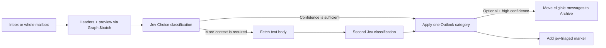

# jevOutlook

### Turn an overloaded Outlook inbox into a small, useful system of categories.

Semantic email classification for **Outlook / Microsoft 365 / Outlook.com** mailboxes,
powered by **Jev** (TypeSafe's System One decision model) through **OpenRouter**, with
confidence-aware automation, cost controls, and no hosted backend.

This is the Microsoft-platform counterpart of
[jevMail](https://github.com/ilyamk/jev-gmail-ai-spam-filter-and-labeling) (Gmail +
Google Apps Script). Same decision logic, same playbooks, same safety model — written in
**C# / .NET 10** and talking to your mailbox through **Microsoft Graph**.

| jevMail (Gmail) | jevOutlook (Outlook) |
| --- | --- |
| Google Apps Script web app | .NET 10 console app `jevoutlook` |
| Gmail API | Microsoft Graph (`/me/messages`, `/me/mailFolders`, `/me/outlook/masterCategories`) |
| Gmail labels | Outlook **categories** (created in the master category list with a colour) |
| Archive = remove `INBOX` label | Move to the **Archive** folder |
| Technical label `jev-triaged` | Technical category `jev-triaged` |
| Apps Script User Properties | `~/.jevoutlook/*.json` (mode 0600) |
| Browser tab drives progress | The terminal drives progress; `Ctrl+C` pauses, `continue` resumes |

## Why

Email filters are good at exact senders and keywords. Real inboxes are not. jevOutlook
classifies the **meaning and intent** of each message against rules you write in plain
English, then applies one Outlook category per message — and, only if you enable it and
only above a separate confidence threshold, moves clearly disposable mail to Archive.

| Capability | What it gives you |
| --- | --- |
| **Semantic classification** | Describe a category in natural language instead of maintaining keyword lists. |
| **Your own taxonomy** | Up to 12 categories with criteria tailored to your role, company or workflow. Seven ready-made playbooks. |
| **Confidence-aware processing** | Metadata (headers + preview) is evaluated first. Ambiguous or archive-sensitive messages get a second review with the message text. |
| **Safe automation** | Preview by default. `--live` applies categories only. Archiving requires `--mode labels-archive`, an archive-eligible category **and** a higher confidence threshold. |
| **Cost control** | A run budget is checked before every model request; actual spend is read from OpenRouter usage. |
| **Personal deployment** | Runs on your machine with your own Entra ID app registration. No jevOutlook account, no mailbox copy. |
| **Explainable operations** | Every message shows the selected category, confidence, decision stage and resulting action. |
| **Repeatable cleanup** | Processed messages receive the `jev-triaged` category so later runs skip them. Interrupted runs resume without re-paying for decisions. |

## How it works



1. **You choose the scope**: Inbox or the whole mailbox (Junk, Deleted Items and Drafts
   excluded), optionally unread only, with a message limit.
2. **Metadata first**: sender, recipients, subject, date, list/automation headers and the
   255-character preview are sent for a cheap first classification.
3. **Jev selects one configured category**. Every email is an independent request; content
   from different messages is never combined.
4. **Ambiguous messages get more context**: if confidence is below your threshold, or an
   archive decision needs stronger evidence, the text body is fetched (capped at 5 000
   characters) and the message is classified again.
5. **Each decision is checkpointed before Outlook is touched**. Categories are applied in
   grouped, idempotent Graph batch writes; archive moves come last.
6. **Progress stays visible** in the terminal: processed, metadata-only, full-content,
   archived, skipped, model requests, spend, active time.

jevOutlook never deletes messages, never marks them as junk, never replies or forwards.

## Setup

### Before you begin

- A Microsoft 365 work/school account or a personal Outlook.com account.
- An [OpenRouter](https://openrouter.ai/) account with a small credit balance
  (or a direct TypeSafe API key — see *Providers* below).
- The [.NET 10 SDK](https://dotnet.microsoft.com/download) to build from source.
- About 15 minutes for the first run, most of it in the Entra portal.

### 1. Build

```bash
git clone <this repository> && cd OutlookClassification
dotnet build -c Release
# or produce a single self-contained binary:
dotnet publish src/JevOutlook -c Release -o release/jevoutlook
```

The examples below assume `jevoutlook` is on your `PATH`
(`src/JevOutlook/bin/Release/net10.0/jevoutlook` or `release/jevoutlook/jevoutlook`).

### 2. Register an application in Microsoft Entra ID

This is the Microsoft equivalent of "enable the Gmail API and deploy the web app": it gives
jevOutlook permission to act on **your** mailbox, under **your** identity.

1. Open <https://entra.microsoft.com> → **Applications → App registrations → New registration**.
2. Name: `jevOutlook`. Supported account types: **Accounts in any organizational directory and
   personal Microsoft accounts** (choose *this organization only* if you only use a work mailbox
   and your tenant requires it).
3. Redirect URI: platform **Mobile and desktop applications**, URI `http://localhost`.
4. After creation: **Authentication → Advanced settings → Allow public client flows: Yes**
   (needed for the device-code flow on headless machines).
5. **API permissions → Add a permission → Microsoft Graph → Delegated**:
   `Mail.ReadWrite`, `MailboxSettings.ReadWrite`, `User.Read`. Grant admin consent if your
   organisation requires it.
6. Copy the **Application (client) ID**.

```bash
jevoutlook config set client-id <application-client-id>
# work/school tenant only: jevoutlook config set tenant-id <tenant-id>
# personal Outlook.com only:  jevoutlook config set tenant-id consumers
```

### 3. Sign in to Microsoft

```bash
jevoutlook auth               # opens the browser sign-in
jevoutlook auth --device-code # or print a code to enter on another device
jevoutlook auth --status
```

Tokens are cached by MSAL (Keychain on macOS, DPAPI on Windows) and the authentication record
is saved in `~/.jevoutlook/auth-record.json`, so later runs are silent.

### 4. Connect OpenRouter

Create a dedicated key at <https://openrouter.ai/workspaces/default/keys>, ideally with a
credit limit, then either export it or store it:

```bash
export OPENROUTER_API_KEY=sk-or-...      # preferred: nothing written to disk
# or
jevoutlook key set sk-or-...             # stored in ~/.jevoutlook/config.json (0600)
jevoutlook key test                      # one tiny Jev request against a sample email
```

### 5. Choose your categories

```bash
jevoutlook playbooks                    # list the 7 ready-made category sets
jevoutlook rules use universal          # default: the Universal inbox playbook
jevoutlook rules show
jevoutlook rules export my-rules.json   # edit names / criteria / archive eligibility…
jevoutlook rules import my-rules.json   # …and load them back (validated)
```

A rule is `{ "id", "name", "description", "spam" }`. `name` becomes the Outlook category;
`description` is the classification criterion sent to Jev; `spam: true` marks the category
**archive eligible**. Names cannot contain `,` or `;` (Outlook category separators) and cannot
be the reserved marker `jev-triaged`.

### 6. Run a safe validation sample

```bash
jevoutlook run                     # PREVIEW · Inbox · unread only · 10 messages · $0.10 budget
```

Recommended first-run settings (these are the defaults):

| Setting | Default |
| --- | --- |
| Scope | Inbox (`--scope all` for the whole mailbox) |
| Unread only | yes (`--include-read` to disable) |
| Message limit | 10 (`--limit 100`, `--limit all`) |
| Processing mode | categories only (`--mode labels-archive` to enable archiving) |
| Preview only | yes (`--live` to write to Outlook) |
| Maximum processing cost | $0.10 (`--max-spend 1`) |
| Metadata confidence threshold | 0.75 |
| Archive confidence threshold | 0.93 |

Review the table of results, adjust criteria for messages that land in the wrong category,
then run a small live pass:

```bash
jevoutlook run --live --limit 25
```

Enable archiving only after repeated validation:

```bash
jevoutlook run --live --mode labels-archive --archive-threshold 0.95 --limit 100
```

`Ctrl+C` pauses safely at any time. `jevoutlook status` shows the session;
`jevoutlook continue` resumes it (add `--max-spend` to raise a reached budget);
`jevoutlook clear-job` forgets a finished session.

## Label playbooks

Each message receives **one** category. The default **Universal inbox** playbook:

| Category | Criteria (summary) | Archive eligible |
| --- | --- | :---: |
| `action-required` | Needs a reply, decision, approval, task or time-sensitive intervention. | No |
| `important-update` | Meaningful update worth keeping, no action needed now. | No |
| `personal` | Person-to-person conversation. | No |
| `money-and-orders` | Receipts, invoices, orders, bank notices without an open problem. | No |
| `opportunities` | Specific, credible job/business/partnership opportunity. | No |
| `newsletters` | Opt-in recurring editorial content. | No |
| `routine-notifications` | Low-risk automated notifications. | **Yes** |
| `cold-outreach` | Unsolicited commercial/recruiting/PR outreach. | **Yes** |
| `junk` | Phishing, scams, irrelevant mass spam. | **Yes** |
| `review` | Safe fallback for ambiguous legitimate mail. | No |

Other playbooks: `founders-operators`, `sales-business-development`, `investors`,
`recruiting-people`, `freelancers-creators`, `support-commerce` — identical to jevMail's.

Once categories are applied, Outlook search and rules become far more useful:
`category:action-required`, `category:opportunities received:last week`, etc.

## Providers

| Provider | Endpoint | Model id | Key |
| --- | --- | --- | --- |
| OpenRouter (default) | `https://openrouter.ai/api/alpha/decisions` | `~typesafe/jev-latest` | `OPENROUTER_API_KEY` |
| TypeSafe direct | `https://api.typesafe.ai/v1/systemone` | `jev-latest` | `JEV_API_KEY` |

```bash
jevoutlook config set provider typesafe
```

Both return the same Choice contract (`answers.label.choice / probabilities / confidence`).
OpenRouter additionally reports `usage.cost`, which jevOutlook prefers for spend accounting;
otherwise cost is derived from `usage.input_tokens` at $0.042 per million, or from a
conservative pre-request estimate.

## Privacy and data handling

- The app runs on your machine. Mailbox access goes through Microsoft Graph with delegated
  permissions granted to **your own** Entra app registration.
- Rules, processing state, the authentication record and (optionally) the API key live in
  `~/.jevoutlook/` with file mode 0600.
- For each selected message, jevOutlook sends the provider: your category names and criteria,
  sender/recipients/subject/date, mailing-list and automation headers, importance, Focused
  Inbox classification, the 255-character preview, and — only when the confidence policy
  requires it — up to 5 000 characters of text body. Attachments are never sent.
- Requests are independent: one message is never combined with another.
- Review [OpenRouter privacy](https://openrouter.ai/docs/features/privacy-and-logging) and
  [TypeSafe data handling](https://docs.typesafe.ai/models#data-handling) before processing
  sensitive mail. This project is not a substitute for your organisation's compliance review.

### Built-in safety controls

- **Preview by default**: nothing is written without `--live`.
- **Categories only by default**: archiving needs `--mode labels-archive`, an archive-eligible
  category, confidence ≥ the archive threshold, and an interactive confirmation (`--yes` to skip).
- **Fail closed**: any invalid model response, missing body or unavailable message is skipped
  without changing Outlook; three consecutive invalid responses pause the session.
- **Budget**: no model request starts if it could exceed `--max-spend`.
- **Idempotent writes**: categories are merged into the existing list (nothing is removed);
  a replay after an interruption re-applies the same decision instead of asking the model again.
- jevOutlook never deletes messages, never marks junk, never sends mail.

## Frequently asked questions

**Will it delete my email?** No. It adds categories. Optional archiving moves a message to the
Archive folder; nothing goes to Deleted Items or Junk.

**Why categories and not folders?** Categories are Outlook's native multi-value label. They
survive moves, work in every Outlook client, are searchable (`category:x`) and can drive
Outlook rules. Moving mail into folders would fight with your existing organisation.

**How do I reprocess messages?** Remove the `jev-triaged` category from them (Outlook: select →
Categorize → clear) and start a new session.

**Does it work with Outlook.com personal accounts?** Yes, through the same Graph endpoints,
provided the app registration allows personal Microsoft accounts.

**Why is the estimate approximate for `--scope all`?** Graph gives exact counts per folder;
across the whole mailbox jevOutlook asks for `$count`, which may be unavailable.

**Non-English mail?** Jev accepts multilingual text but English is its strongest language.
Validate on your own messages before enabling live writes or archiving.

## Important limitations

- AI classification can be wrong; confidence reduces risk but does not remove it.
- Exactly one category per message per run; only text is evaluated.
- Microsoft Graph throttling (about 4 concurrent requests per app and mailbox, 10 000 requests
  per 10 minutes), OpenRouter and model quotas still apply; the run pauses safely and can be continued.
- Messages arriving after a session starts are not part of that session.
- Provided as-is; test carefully before enabling archiving.

## Project layout

```
src/JevOutlook/            .NET 10 console app (assembly: jevoutlook)
  AppConstants.cs          tunables (mirrors jevMail's APP block)
  Rules/                   LabelRule, Playbooks, RuleValidator
  Storage/                 ~/.jevoutlook JSON stores (config, rules, job)
  Graph/                   Azure.Identity sign-in, Graph mail client, message normalisation
  Jev/                     payload builder, Decisions client + strict contract validation
  Triage/                  job model, run options, TriageEngine (waves, budget, checkpoints)
  Cli/                     command parsing and terminal rendering
tests/JevOutlook.Tests/    xUnit tests for the pure logic
ARCHITECTURE_EN.md / ARCHITECTURE.md   technical design (EN source of truth / FR mirror)
```

## Documentation and services

| Resource | Link |
| --- | --- |
| Jev introduction | <https://docs.typesafe.ai/introduction> |
| Choice classification | <https://docs.typesafe.ai/primitives/choice> |
| Confidence | <https://docs.typesafe.ai/confidence> |
| TypeSafe HTTP API | <https://docs.typesafe.ai/api> |
| OpenRouter keys | <https://openrouter.ai/workspaces/default/keys> |
| Microsoft Graph mail API | <https://learn.microsoft.com/graph/api/resources/mail-api-overview> |
| Register an app in Entra ID | <https://learn.microsoft.com/entra/identity-platform/quickstart-register-app> |
| Azure.Identity | <https://learn.microsoft.com/dotnet/api/overview/azure/identity-readme> |

## Credits

- **AI decision model:** [TypeSafe — Jev](https://typesafe.ai/)
- **Model access and billing:** [OpenRouter](https://openrouter.ai/)
- **Original Gmail implementation and playbooks:** [jevMail by Ilia AGI](https://github.com/ilyamk/jev-gmail-ai-spam-filter-and-labeling)
- **Mailbox API:** [Microsoft Graph](https://learn.microsoft.com/graph/)
