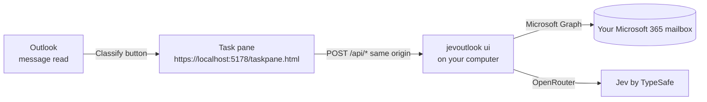

# The jevOutlook Outlook add-in

**Classify the message you are reading, from inside Outlook, with Jev: one click to see the
category and its confidence, a second click to apply it. The add-in is a thin pane over the
jevOutlook server that runs on your own computer.**

This guide is for someone who has never used jevOutlook and wants to install the add-in and
use it. It covers the whole path: what the add-in does, how it works, what you need,
installation, daily use, updates, removal, security and troubleshooting. The main
[README](../README.md) covers the rest of jevOutlook: the dashboard, the command line, and
Gmail and IMAP mailboxes.

A shorter visual version of this guide is on the project site:
<https://vincentlauriat.github.io/MailClassification.jev/addin/>.

> **Status, up front.** The pane, its API and the manifest work and are tested. Sideloading
> the add-in into a real Outlook client has **not yet been validated end to end**. The one
> attempt so far was on a corporate tenant that blocks custom add-ins, and it failed there.
> See [§11](#11-status-and-limitations) before you start.

---

## Table of contents

1. [What the add-in does](#1-what-the-add-in-does)
2. [How it works](#2-how-it-works)
3. [Requirements](#3-requirements)
4. [Installation, step by step](#4-installation-step-by-step)
5. [Using the add-in](#5-using-the-add-in)
6. [Updating](#6-updating)
7. [Uninstalling](#7-uninstalling)
8. [Security and privacy](#8-security-and-privacy)
9. [Troubleshooting](#9-troubleshooting)
10. [Reference](#10-reference)
11. [Status and limitations](#11-status-and-limitations)

---

## 1. What the add-in does

When you read a message, Outlook shows a **jevOutlook** group on the ribbon. The group has one button,
**Classify**. It opens a task pane next to the message. The pane has two cards and a footer.

### "This message"

The card shows the subject and the sender of the open message.

1. **Classify with Jev** asks Jev which of *your* categories fits the message. The categories
   are the same rules the dashboard and the CLI use (README
   [§9](../README.md#9-categories-playbooks-and-your-own-rules)). The pane then shows:
   - the **label**, which is the chosen category;
   - the **confidence**, the probability of that category, between 0 and 1. It turns green
     at 0.75 or above;
   - the **stage**: `metadata only` if the headers and the preview were enough, or
     `full-content review` if the text body was read too;
   - the **top 5 probabilities**, as bars;
   - the **cost** of the request, for example `Cost $0.000135`.
2. **Apply category** adds that category to the message.
3. **Apply + archive** adds the category and moves the message to the Archive folder. The
   button only appears when the chosen category is marked *archive eligible* in your rules
   **and** its confidence is at least 0.93, the same archive threshold as a batch run.

**Nothing changes in Outlook until you click Apply.** Classifying is read-only. Applying
**adds** the category: the message's existing categories are kept. If the message already
carries one of your configured categories, the pane says so before you apply.

### "Inbox run"

The card runs the same batch process as the dashboard, on the Inbox of your Microsoft 365
mailbox, from inside Outlook.

| Setting | Choices | Default |
| --- | --- | --- |
| **Limit** | 10, 50, 100 or all | 10 |
| **Preview only** | on or off | **on**: nothing is written |
| **Mode** | categories only, or categories + archive | categories only |
| **unread only** | on or off | on |

Some values are fixed in the pane. To change them, use the full dashboard or the CLI.

| Fixed value | In the pane |
| --- | --- |
| Budget per run | $0.10 |
| Metadata threshold | 0.75 |
| Archive threshold | 0.93 |
| Scope | Inbox |

- A note under the settings always says whether the run is a **PREVIEW** or a **LIVE** run.
- A live run with archiving asks for confirmation first: *"LIVE run with archiving: eligible
  messages will be moved to Archive. Continue?"*
- While the run goes on, the pane shows the progress: messages handled out of the target,
  the spend, and the status. It also keeps a live list of the **last 12 results**, each with
  its subject and category.
- **Stop** ends the run from the pane. Read the note about Stop in [§5.2](#52-an-inbox-run).

### Footer

- A link to the **full dashboard**, <http://127.0.0.1:5177/>, which opens in your browser.
- The name of the model in use, normally `~typesafe/jev-latest`.
- At the top of the pane, the header shows the signed-in mailbox. It adds `· no API key`
  when jevOutlook has no OpenRouter key.

## 2. How it works



- **The pane is not hosted in the cloud.** Outlook loads it from your own computer, at
  `https://localhost:5178/taskpane.html`. The page is served by the `jevoutlook ui` process,
  the same process that serves the dashboard on `http://127.0.0.1:5177/`. If that process is
  not running, Outlook has nothing to load.
- **HTTPS with the ASP.NET Core development certificate.** Outlook only loads add-in pages
  over HTTPS. `jevoutlook ui` listens on port 5178 with the .NET development certificate, which
  you trust once with `dotnet dev-certs https --trust`.
- **The pane calls a local API.** Every action is a `POST /api/<function>` with a JSON body,
  sent to the same origin the pane came from. The pane uses four functions:
  `classifyItem`, `applyItem`, `getUiState` and `authStatus`. The Inbox run uses the same
  job functions as the dashboard.
- **The add-in has no sign-in of its own.** It reuses what jevOutlook already has: the
  Microsoft 365 sign-in you made with `jevoutlook account add … --m365`, and the stored
  OpenRouter key. The pane does not name a mailbox, so the server uses the **first
  Microsoft 365 mailbox that has a sign-in record**, in the order of `jevoutlook account list`.
- **Finding the message.** Outlook gives the pane an item id. The pane converts it with
  `Office.context.mailbox.convertToRestId` (REST v2.0 format). The server then reads the
  message through Microsoft Graph, with the same two-stage policy as a run: headers and preview
  first, then the text body only if the confidence is below 0.75.
- **Writing.** On Apply, the server re-reads the message's current categories, adds yours and
  writes the merged list. For archiving, it then moves the message to Archive. This is the same
  code as a live run (README [§3](../README.md#3-how-a-message-gets-its-category)).

## 3. Requirements

| You need | Why, and where to get it |
| --- | --- |
| A **Microsoft 365** (work or school) or **Outlook.com** mailbox | The add-in reads and writes through Microsoft Graph. **Gmail and IMAP mailboxes are not supported by the add-in**; use the dashboard or the CLI for them. |
| The **.NET 10 SDK** | To build jevOutlook and to create the development certificate. <https://dotnet.microsoft.com/download>. macOS, Windows or Linux. |
| An **Entra ID app registration** | The one-time Microsoft registration that lets jevOutlook act on your mailbox. About 10 minutes: README [§6.2](../README.md#62-microsoft-365--outlookcom-mailboxes). |
| An **OpenRouter key** | Jev is reached through OpenRouter, which bills per request, about one cent per hundred messages: README [§6.1](../README.md#61-the-model-an-openrouter-key). |
| A **trusted development certificate** | `dotnet dev-certs https --trust`, step 4 below. |
| An organisation that **allows custom add-ins** | Many companies disable them. If yours does, the sideload fails and only a tenant administrator can change that. Personal Outlook.com accounts are not affected by tenant policies. |
| A supported **Outlook client**, on the **same computer** as the server | See below. |

**Outlook clients.** The manifest asks for the Mailbox requirement set **1.1**, and declares
its ribbon button in `VersionOverrides` at requirement set **1.3**. That covers:

- Outlook on the web;
- new Outlook for Windows;
- Outlook for Mac;
- classic Outlook for Windows.

It is a desktop form factor only: Outlook on iOS and Android will not show the add-in.

**What has actually been checked:** only the pane itself, opened directly in a browser (Chrome).
The list of clients above is what the manifest declares and Microsoft's requirement sets
cover. It has not been tested client by client.

**Same computer.** The pane is loaded from `localhost`. Outlook on another device, even signed
in to the same mailbox, cannot reach the server on your computer. There it gets a pane that
does not load.

## 4. Installation, step by step

The commands below use macOS or Linux syntax. On Windows, in PowerShell, write
`$HOME\.jevoutlook\bin` instead of `~/.jevoutlook/bin`, and the executable is
`jevoutlook.exe`.

### Step 1 — Get the code, build and publish

```bash
git clone https://github.com/vincentlauriat/MailClassification.jev.git
cd MailClassification.jev
dotnet publish src/JevOutlook -c Release -o ~/.jevoutlook/bin
```

This produces a stable copy of the executable in `~/.jevoutlook/bin`. It is the copy the
background service will run, so a later `dotnet build` or `dotnet clean` in the repository
cannot pull it from under the service. Put that directory on your `PATH`, or type the full
path `~/.jevoutlook/bin/jevoutlook` in the commands below. Check that it runs:

```bash
jevoutlook version
```

### Step 2 — Store the OpenRouter key

```bash
jevoutlook key set sk-or-...
jevoutlook key test        # → "OK — model ~typesafe/jev-latest"
```

The key is stored in `~/.jevoutlook/config.json` (mode 0600). **Store it, even if you
already export `OPENROUTER_API_KEY` in your shell.** The background service of step 5 does not
inherit your shell's variables, so without a stored key the pane shows `· no API key`.
How to create a key: README [§6.1](../README.md#61-the-model-an-openrouter-key).

### Step 3 — Connect your Microsoft 365 mailbox

Create the Entra app registration once, following README
[§6.2](../README.md#62-microsoft-365--outlookcom-mailboxes). Then:

```bash
jevoutlook config set client-id <application-client-id>
jevoutlook account add alice@contoso.com --m365
```

Open the link that is printed, type the code, and sign in with the mailbox's account. When it
works, jevOutlook prints `Signed in as …`. For a personal Outlook.com account, add
`--tenant consumers`. If the sign-in page says *"Need admin approval"*, see the options in
README §6.2.

### Step 4 — Trust the development certificate

```bash
dotnet dev-certs https --trust
```

Run it once per computer. On macOS it asks for your password to add the certificate to the
Keychain; on Windows it shows a confirmation dialog. Linux browsers and distributions handle
trust differently: see `dotnet dev-certs https --help` and Microsoft's documentation for your
distribution.

### Step 5 — Keep the server running

The pane only loads while `jevoutlook ui` runs.

**macOS: install the background service** (a per-user LaunchAgent, which starts at login and
restarts if the server stops):

```bash
jevoutlook service install --exe ~/.jevoutlook/bin/jevoutlook
jevoutlook service status
```

`service status` should show a `Health` line like this one (the version number will vary):

```
Health  : jevOutlook 0.1.0 answers on http://127.0.0.1:5177/
```

The service writes its output to `~/.jevoutlook/logs/ui.log`. If `service install` warns that
`DOTNET_ROOT is not set`, export `DOTNET_ROOT` to your .NET install directory and run the
install again. README [§6.5](../README.md#65-keep-the-dashboard-running-macos) has the
details.

**Windows and Linux: there is no `service` command yet.** On those systems,
`jevoutlook service` answers: *"'jevoutlook service' manages a macOS LaunchAgent. On other
systems, run 'jevoutlook ui --no-open' from your own service manager."* Start the server
yourself and keep it running:

```bash
jevoutlook ui --no-open
```

To have it start by itself, register that command with your system's own tools: for
example a Task Scheduler task "at log on" on Windows, or a systemd user service on Linux.
If it runs from a terminal, closing the terminal stops the pane.

### Step 6 — Check the pane in a browser

Open <https://localhost:5178/taskpane.html>.

- It must load **without a certificate warning**. If you see one, go back to step 4.
- The header shows your mailbox. The "This message" card says *"No message selected. You can
  still classify the latest inbox message."*
- Optional smoke test: click **Classify with Jev**. Outside Outlook, the pane classifies the
  newest message of your Inbox. It is read-only, and it costs a fraction of a cent.

### Step 7 — Get the manifest

The manifest is the small XML file that tells Outlook where the pane is. There are two ways
to get it.

- **Download it from the running server:** <https://localhost:5178/manifest.xml>. It always
  matches the server's HTTPS port.
- **Write it with the CLI:**

  ```bash
  jevoutlook addin manifest --out ~/jevoutlook-manifest.xml
  ```

  Without `--out`, the file is written to `release/jevoutlook-manifest.xml` **under the current
  directory**. If you changed the HTTPS port, pass it: `--https-port <port>`.

### Step 8 — Sideload the add-in in Outlook

"Sideloading" means installing an add-in from a file, for yourself only. Microsoft moves these
menus from time to time. The paths below are the usual ones. The reference is Microsoft's
guide,
[Sideload Outlook add-ins for testing](https://learn.microsoft.com/office/dev/add-ins/outlook/sideload-outlook-add-ins-for-testing).

| Client | Usual path |
| --- | --- |
| **Outlook on the web** and **new Outlook for Windows** | Open <https://aka.ms/olksideload>. It opens Outlook on the web, then the **Add-ins for Outlook** dialog. Choose **My add-ins**, then under **Custom add-ins** choose **Add a custom add-in → Add from file…**, and pick the manifest. |
| **Outlook for Mac** | **Get Add-ins**, which may sit under the **…** (More) menu of the ribbon or the message. Then the same **My add-ins → Custom add-ins → Add a custom add-in → Add from file…**. |
| **Classic Outlook for Windows** | **Home → Get Add-ins**, or **File → Manage Add-ins**. Then the same **My add-ins → Custom add-ins → Add a custom add-in → Add from file…**. |

Outlook may warn that the add-in is not verified by Microsoft. That is expected for a custom
add-in; confirm to install it. An add-in installed in one client usually appears in the
others signed in to the same mailbox, but only the computer running the server can load its
pane.

If you see **"Add-in installation failed"** with no other detail, custom add-ins are most
likely disabled for your organisation. See [§9](#9-troubleshooting).

### Step 9 — First use

1. Open a message in Outlook, in the reading pane or in its own window.
2. On the ribbon, or in the **…** / **Apps** menu depending on the client, find the
   **jevOutlook** group and choose **Classify**.
3. In the pane, click **Classify with Jev**.

## 5. Using the add-in

### 5.1 One message

1. Open the message and the pane, then click **Classify with Jev**. It takes a second or two;
   a little longer when the text body has to be read.
2. Read the result.
   - **The label and its confidence.** The confidence is the probability Jev gave to that
     category. It is green at 0.75 or above.
   - **The stage.** `metadata only` means the sender, the recipients, the subject, the
     mailing-list headers and the first 255 characters were enough. `full-content review`
     means the confidence was below 0.75, so up to 5 000 characters of the text body were sent
     and Jev was asked again. The pane then adds *"metadata was uncertain, the body was
     reviewed too"* after the cost.
   - **The five bars** show how the probability is spread. A close second category is a sign
     that your criteria overlap: sharpen them (README
     [§9](../README.md#9-categories-playbooks-and-your-own-rules)).
   - **The cost.** One stage costs a fraction of a hundredth of a cent. Two stages cost about
     twice that.
3. Click **Apply category**, or **Apply + archive** when it is offered. The pane confirms with
   the message's resulting list of categories, or with *"Category applied and message moved to
   Archive."*

**Archiving follows the batch rule.** When the category is archive eligible but the metadata
pass is below 0.93, the pane reads the message text before deciding, exactly as a batch run in
archive mode does. If the final confidence is still below 0.93, **Apply + archive** is not
offered and the note says why; **Apply category** stays available.

When you select another message while the pane is open, the pane follows it and clears the
previous result, if your Outlook client keeps the pane open.

What "confidence" means and how the two thresholds work: README
[§10](../README.md#10-understanding-confidence-and-the-two-thresholds).

### 5.2 An Inbox run

1. Leave **Preview only** ticked for the first runs. The pane then writes nothing and ends
   with *"Preview completed — no Outlook changes."*
2. Choose the **limit**, the **mode** and **unread only**, then **Start**. The progress line
   reads, for example, `PREVIEW · 10 / 10 · $0.0015 · completed`.
3. When the previews look right, untick **Preview only**. The note under the settings changes
   colour and reads *LIVE*. Start with categories only; add archiving only after several validated live runs.
   A live run with archiving asks for confirmation.

The rules of a run are the same as in the dashboard (README
[§8](../README.md#8-going-live-categories-then-archiving)). A message that already carries one
of your categories is skipped. Archiving needs the archive mode, an archive-eligible category
**and** a confidence of at least 0.93. The run stops by itself at the $0.10 budget.

**About Stop.** **Stop** ends the pane's run loop and cancels the session on the server, so
the next **Start** begins a new one. Nothing is lost: every decision is checkpointed.

**Closing the pane mid-run** leaves the session active on the server. Re-opening the pane
shows its progress line, but the pane does not resume it; a new **Start** then answers *"A
processing session is already active. Stop or continue it before starting another."* Resume or
stop it from the full dashboard (footer link), or finish it with `jevoutlook continue`.

### 5.3 Costs

A single classification costs a fraction of a hundredth of a cent. An Inbox run of 100
messages cost $0.009 in a measured live run, and each pane run is capped at $0.10. How costs
are estimated and reported: README [§11](../README.md#11-what-it-costs).

## 6. Updating

```bash
cd MailClassification.jev
git pull
dotnet publish src/JevOutlook -c Release -o ~/.jevoutlook/bin
jevoutlook service restart          # macOS; elsewhere, stop and start 'jevoutlook ui --no-open'
```

The pane is served by the server, so Outlook picks up the new pane the next time it opens it.
You do **not** need to sideload again unless the **manifest itself** changes. That happens
when you change the HTTPS port, or when a new version changes the add-in's manifest, for
example its version number (`1.0.0.0` today). To compare, download
<https://localhost:5178/manifest.xml> and diff it with the file you installed.

## 7. Uninstalling

1. **In Outlook**, open the same **My add-ins** dialog as in step 8. Under **Custom add-ins**,
   open the **…** menu of jevOutlook and choose **Remove**. The exact wording can vary by
   client; Microsoft's sideload guide linked above describes it.
2. **Stop the server.**
   - macOS: `jevoutlook service uninstall`. It stops the LaunchAgent and deletes its plist.
   - Windows and Linux: remove the task or service you created, and stop `jevoutlook ui`.
3. **Optional: remove the development certificate** with `dotnet dev-certs https --clean`.
   Other .NET projects on the computer may use it.
4. **Optional: remove jevOutlook's data.** Delete `~/.jevoutlook`, and with it your settings,
   rules, mailboxes and stored key. Run `jevoutlook account remove <id>` first, so the stored
   passwords and sign-ins are removed from the Keychain as well. See README
   [§13](../README.md#13-files-state-and-secrets).

## 8. Security and privacy

- **Loopback only.** The server listens on `localhost` (ports 5177 and 5178) and cannot be
  reached from another machine.
- **Host allowlist.** A request whose `Host` header is not `127.0.0.1` or `localhost` with one
  of those ports gets **421 Misdirected Request**. This protects against DNS rebinding.
- **Same-origin, JSON, POST only.** `/api/*` refuses any request that comes from another
  origin, that is not `application/json`, or that is not a `POST`, with **403**. A web page on
  another site cannot drive your mailbox through the local server.
- **Permission `ReadWriteItem`.** The manifest asks Outlook for read/write access to the
  current item only. The actual reads and writes go through Microsoft Graph, with the delegated
  permissions of your own app registration: `Mail.ReadWrite`, `MailboxSettings.ReadWrite` and
  `User.Read`.
- **What is sent to the model.** For the message you classify: your category names and
  criteria, the sender, recipients, subject and date, the mailing-list and automation headers,
  the importance, a 255-character preview, and up to 5 000 characters of text only when the
  second stage is needed. Never attachments. Details: README
  [§15](../README.md#15-privacy-and-data-handling).
- **Email content is untrusted.** The pane displays subjects, senders and category names as
  text nodes, never as HTML, so a crafted email cannot inject markup or script into the pane.
  The model prompt tells Jev never to follow instructions found in an email.
- **No secret in the service.** The LaunchAgent plist is plain text, so API keys are never
  copied into it. Only `DOTNET_ROOT` and `JEVOUTLOOK_HOME` are carried over. The key lives in
  `~/.jevoutlook/config.json` (mode 0600), and Microsoft tokens live in the OS credential cache.
- **One external script.** The pane loads Microsoft's `office.js` from
  `appsforoffice.microsoft.com`, as every Office add-in does. Nothing else leaves your computer,
  apart from the Graph and OpenRouter calls made by the server.

## 9. Troubleshooting

| Symptom | Cause and fix |
| --- | --- |
| **The pane is blank, or Outlook says it can't reach the add-in** | The server is not running, so Outlook has nothing to load. macOS: `jevoutlook service status`, then `jevoutlook service restart`, or `service install` if the agent is not installed. Read `~/.jevoutlook/logs/ui.log`. Windows/Linux: start `jevoutlook ui --no-open`. |
| **Certificate warning at https://localhost:5178, or a blank pane although the server runs** | The development certificate is missing or not trusted. Run `dotnet dev-certs https --trust`, then restart the server (`jevoutlook service restart`). Restart Outlook, or the browser, as well. |
| **The server log says "HTTPS could not be started … Continuing with HTTP only (dashboard works, add-in pane will not load)"** | No development certificate was found. The dashboard works on port 5177, but nothing listens on 5178, so the pane cannot load and `/manifest.xml` is unavailable. Run `dotnet dev-certs https --trust`, then restart. |
| **The pane header says "Local server unreachable: …"** | The pane loaded, but its first API call failed. **Read the text after the colon.** A network error means the server stopped after the pane was loaded: `jevoutlook service status` / `service restart`. A message such as *"Unknown account …"* or *"Several mailboxes are configured …"* means the server runs but no Microsoft 365 mailbox is usable: check `jevoutlook account list`. |
| **"Not signed in — use the dashboard"** | The Microsoft sign-in is missing or expired. `jevoutlook account login <id>`, or sign in again from the dashboard's Mailboxes card. |
| **"· no API key" in the header, or "Enter an API key for … (jevoutlook key set <key>)" on Classify** | The server has no OpenRouter key. `jevoutlook key set <key>`, then `jevoutlook key test`. The LaunchAgent does not see a key that is only exported in your shell. |
| **"This message could not be found in the mailbox"** | The message was moved or deleted, or it belongs to a different mailbox than the one the server uses, which is the first signed-in Microsoft 365 mailbox. Shared and delegated mailboxes are not supported. |
| **"A processing session is already active…" on Start** | A previous run was interrupted by closing the pane ([§5.2](#52-an-inbox-run)). Resume or stop it in the full dashboard, or run `jevoutlook continue`. |
| **"Add-in installation failed" at sideload, or no custom add-ins option** | A tenant policy that disables custom add-ins. jevOutlook cannot bypass it; only a tenant administrator can change it. A personal Outlook.com account is not subject to it. |
| **"Port 5177 answers but not as a current jevOutlook …"** | Another program, or an old jevOutlook build, holds the port. Stop it, or choose other ports: `jevoutlook ui --port <p> --https-port <q>`, or on macOS `service install --port <p> --https-port <q> --exe …`. Then regenerate the manifest with `addin manifest --https-port <q>` and sideload it again. |
| **The ribbon shows no jevOutlook group** | The add-in is not installed for this mailbox, or the client hides add-in buttons under **…** / **Apps**. Check **My add-ins**. The add-in only appears when **reading** a message, not when composing one. |

More: README [§14](../README.md#14-troubleshooting).

## 10. Reference

| Command | What it does |
| --- | --- |
| `jevoutlook ui [--port 5177] [--https-port 5178] [--no-https] [--no-open]` | Starts the dashboard (HTTP) and the add-in pane (HTTPS). If a jevOutlook server already runs, it says *already running* and exits. |
| `jevoutlook addin manifest [--https-port 5178] [--out <file.xml>]` | Writes the manifest. The default path is `release/jevoutlook-manifest.xml` under the current directory. |
| `jevoutlook service install [--port 5177] [--https-port 5178] [--exe <path>]` | macOS only: installs the LaunchAgent that runs `ui --no-open` from login. |
| `jevoutlook service status [--port 5177]` | macOS only: plist, agent state, `/health` probe, log path. Exit code 1 when the server does not answer. |
| `jevoutlook service restart` / `service uninstall` | macOS only: restarts the agent, or stops and removes it. |

| URL | What it is |
| --- | --- |
| `https://localhost:5178/taskpane.html` | The pane Outlook loads. |
| `https://localhost:5178/manifest.xml` | The manifest for the running HTTPS port. It answers 503 when HTTPS is off. |
| `http://127.0.0.1:5177/` | The full dashboard. |
| `http://127.0.0.1:5177/health` | `{"app":"jevoutlook","version":…,"https":…}`, used by `service status` and by `ui` to detect a running server. |

The manifest declares the add-in id `7c1f3f0e-6d2a-4b5e-9c1a-2f0e8a5d4b31`, version `1.0.0.0`,
a read-mode task pane (`ItemRead`, messages only), and a **Classify** button in a
**jevOutlook** group on the message-read ribbon.

## 11. Status and limitations

- **Sideloading into a real Outlook is not validated end to end yet.** The pane has been driven
  in a browser, and the manifest passes Microsoft's validator (`office-addin-manifest
  validate`). The first sideload attempt was on a corporate tenant that blocks custom add-ins,
  and it failed with the generic "installation failed". Reports from other clients and tenants
  are welcome in the GitHub issues.
- **The pane needs the local server running.** This is "option 1": keep the server up at all
  times, with the macOS LaunchAgent or your own service manager. An Office add-in runs in a
  sandbox and cannot start a local program by itself.
- **Option 2, planned: start on demand.** A statically hosted pane would detect that the server
  is down and start it through a small launcher app. It is designed, not built:
  [docs/design/addin-on-demand-start.md](design/addin-on-demand-start.md).
- **Microsoft 365 and Outlook.com only.** Gmail and IMAP mailboxes work in the dashboard and
  the CLI, not in the add-in.
- **One mailbox.** The pane always uses the first signed-in Microsoft 365 mailbox. If you have
  several Microsoft mailboxes, the add-in works only for that one.
- **Desktop Outlook and Outlook on the web, on the computer running the server.** No mobile
  clients.
- **Fixed run settings in the pane**: $0.10 budget, 0.75 / 0.93 thresholds, Inbox scope. Use
  the dashboard or the CLI for anything else.

The architecture behind the add-in, the local server and the LaunchAgent is described in
[ARCHITECTURE_EN.md](../ARCHITECTURE_EN.md): the component map (§3), the security notes (§8) and
the LaunchAgent (§10).
